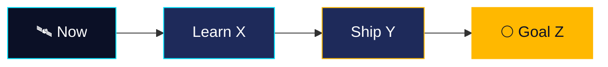

<!--
  MISSION CONTROL PROFILE README — template
  1. Create a PUBLIC repo named exactly like your username (YOUR_USERNAME/YOUR_USERNAME)
  2. Paste this file in as README.md
  3. Find & replace: YOUR_USERNAME, YOUR NAME, and the placeholder text
  Palette: navy 0B1026 · panel 1E2A5A · cyan 00E5FF · amber FFB800
-->

<div align="center">


<br/>


[](mailto:you@example.com)
[](https://linkedin.com/in/YOUR_USERNAME)

**[Mission Profile](#-mission-profile) · [Payload](#-payload) · [Mission Log](#-mission-log) · [Telemetry](#-telemetry) · [Flight Plan](#-flight-plan)**

</div>

---

## 🧑‍🚀 Mission Profile

```ts
const crew = {
  callsign: "YOUR_USERNAME",
  role:     "Your title here",
  base:     "🌍 Your city / Remote",
  mission:  "One sentence about what you're trying to build or learn",
  fuel:     ["☕ Coffee", "🎧 Lo-fi", "🧪 Curiosity"],
  motto:    "Ship small · Learn loud · Stay curious",
};
```

## 🧰 Payload

<div align="center">


</div>

| Module | Systems on board |
| ------ | ---------------- |
| 🚀 **Propulsion** (languages) | Python · TypeScript · Rust |
| 🛰️ **Guidance** (frameworks) | React · FastAPI · Node.js |
| 🗄️ **Cargo bay** (data) | PostgreSQL · Redis · SQLite |
| 🔧 **Ground crew** (DevOps) | Docker · GitHub Actions · Linux |

## 📡 Mission Log

<div align="center">

<a href="https://github.com/YOUR_USERNAME/REPO_ONE"></a>
<a href="https://github.com/YOUR_USERNAME/REPO_TWO"></a>

</div>

| Mission | Objective | Stack | Status |
| ------- | --------- | ----- | ------ |
| 🛸 **Project Alpha** | What it does in one line |  | 🟢 Launched |
| 🌌 **Project Beta** | What it does in one line |  | 🟡 In orbit |
| 🔭 **Project Gamma** | What it does in one line |  | 🔵 Pre-launch |

## 📊 Telemetry

<div align="center">


</div>

## 🗺️ Flight Plan



---

<div align="center">

### 📨 Open a channel

*"Ad astra per aspera."* — replace with a quote you like


</div>
